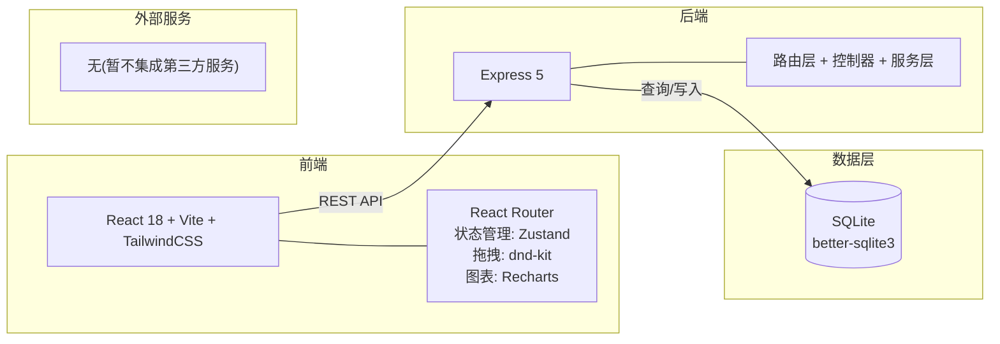
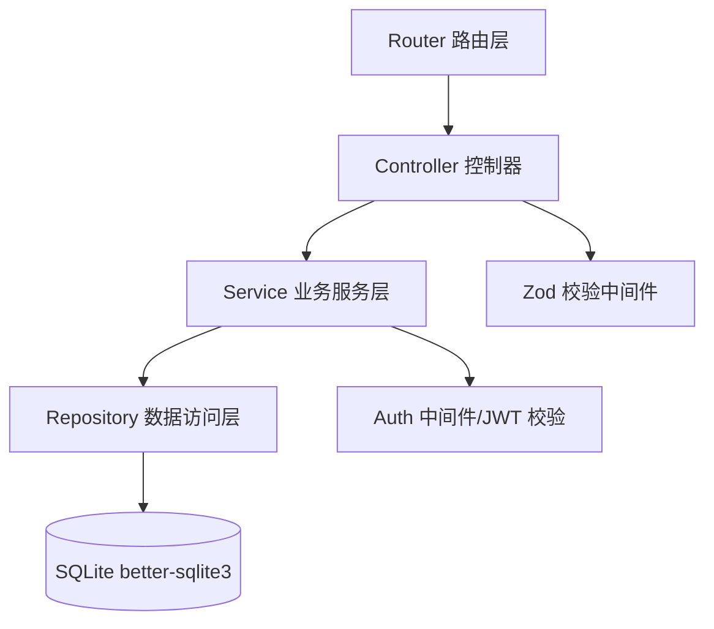
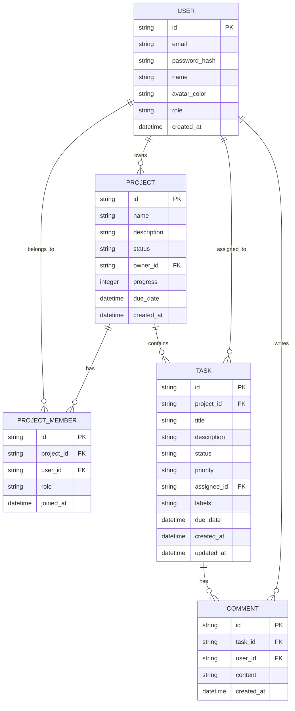

## 1. 架构设计



## 2. 技术描述

- **前端**: React@18 + tailwindcss@3 + vite,React Router 处理路由,Zustand 管理全局状态
- **初始化工具**: vite-init (基于 `npm create vite@latest`)
- **关键前端依赖**:
  - `react-router-dom@6` — 路由
  - `zustand@4` — 状态管理(轻量,避免 Redux 样板)
  - `@dnd-kit/core` + `@dnd-kit/sortable` — 拖拽看板实现
  - `recharts@2` — 图表(进度、燃尽图、工作量)
  - `react-hook-form` — 表单
  - `lucide-react` — 图标库
  - `clsx` + `tailwind-merge` — 样式工具
- **后端**: Express@5 + better-sqlite3,RESTful API
- **数据库**: SQLite(嵌入式,无需额外服务,适合中小团队部署;`better-sqlite3` 提供 JS 同步 API,性能优秀)
- **认证**: JWT(JSON Web Token),密码使用 bcrypt 加密
- **数据校验**: zod(express-zod-api 或手动闭合校验)
- **API 文档**: 暂不集成 Swagger,以类型定义合同为准

## 3. 路由定义

| 路由 | 用途 |
|-------|---------|
| `/login` | 登录页 |
| `/register` | 注册页 |
| `/` | 仪表板首页 |
| `/projects` | 项目列表 |
| `/projects/:projectId` | 项目详情 |
| `/projects/:projectId/board` | 看板视图 |
| `/projects/:projectId/tasks/:taskId` | 任务详情面板(抽屉) |
| `/stats` | 进度跟踪与统计 |
| `/team` | 团队协作与权限管理 |
| `/settings` | 个人设置 |

## 4. API 定义

### 认证相关
```typescript
// POST /api/auth/register
interface RegisterRequest { email: string; password: string; name: string; }
interface AuthResponse { token: string; user: User; }

// POST /api/auth/login
interface LoginRequest { email: string; password: string; }
```

### 实体类型
```typescript
interface User {
  id: string;
  email: string;
  name: string;
  avatarColor: string;
  role: 'admin' | 'owner' | 'member' | 'guest';
  createdAt: string;
}

interface Project {
  id: string;
  name: string;
  description: string;
  status: 'planning' | 'active' | 'completed' | 'archived';
  ownerId: string;
  members: ProjectMember[];
  progress: number;
  createdAt: string;
  dueDate?: string;
}

interface ProjectMember {
  userId: string;
  role: 'owner' | 'editor' | 'viewer';
  joinedAt: string;
}

interface Task {
  id: string;
  projectId: string;
  title: string;
  description: string;
  status: 'todo' | 'in_progress' | 'review' | 'done';
  priority: 'low' | 'medium' | 'high' | 'urgent';
  assigneeId: string | null;
  labels: string[];
  dueDate: string | null;
  createdAt: string;
  updatedAt: string;
}

interface Comment {
  id: string;
  taskId: string;
  userId: string;
  content: string;
  createdAt: string;
}
```

### 任务相关 API
```typescript
// GET /api/projects/:projectId/tasks
// POST /api/projects/:projectId/tasks
// PATCH /api/tasks/:taskId
// PATCH /api/tasks/:taskId/status { status: Task['status'] }
// POST /api/tasks/:taskId/comments

// GET /api/stats/overview
interface StatsOverview {
  totalProjects: number;
  activeProjects: number;
  completedProjects: number;
  overdueProjects: number;
  tasksByStatus: { todo: number; in_progress: number; review: number; done: number; };
  trend: { date: string; completed: number; created: number; }[];
}

// GET /api/stats/burndown?projectId=...
interface BurndownData {
  dates: string[];
  ideal: number[];
  actual: number[];
}
```

## 5. 服务端架构图



分层职责:
- **Router**: 声明路径与 HTTP 方法
- **Controller**: 解析请求、调用 Service、组装响应
- **Service**: 业务逻辑编排,跨实体操作
- **Repository**: 聚焦 SQL 查询与写入
- **Middleware**: 鉴权、参数校验、错误统一处理

## 6. 数据模型

### 6.1 数据模型定义



### 6.2 数据定义语言

```sql
CREATE TABLE users (
  id TEXT PRIMARY KEY,
  email TEXT UNIQUE NOT NULL,
  password_hash TEXT NOT NULL,
  name TEXT NOT NULL,
  avatar_color TEXT NOT NULL DEFAULT '#6366F1',
  role TEXT NOT NULL CHECK(role IN ('admin','owner','member','guest')),
  created_at DATETIME NOT NULL DEFAULT CURRENT_TIMESTAMP
);

CREATE TABLE projects (
  id TEXT PRIMARY KEY,
  name TEXT NOT NULL,
  description TEXT,
  status TEXT NOT NULL CHECK(status IN ('planning','active','completed','archived')),
  owner_id TEXT NOT NULL REFERENCES users(id),
  progress INTEGER NOT NULL DEFAULT 0 CHECK(progress BETWEEN 0 AND 100),
  due_date DATETIME,
  created_at DATETIME NOT NULL DEFAULT CURRENT_TIMESTAMP
);

CREATE TABLE project_members (
  id TEXT PRIMARY KEY,
  project_id TEXT NOT NULL REFERENCES projects(id) ON DELETE CASCADE,
  user_id TEXT NOT NULL REFERENCES users(id) ON DELETE CASCADE,
  role TEXT NOT NULL CHECK(role IN ('owner','editor','viewer')),
  joined_at DATETIME NOT NULL DEFAULT CURRENT_TIMESTAMP,
  UNIQUE(project_id, user_id)
);

CREATE TABLE tasks (
  id TEXT PRIMARY KEY,
  project_id TEXT NOT NULL REFERENCES projects(id) ON DELETE CASCADE,
  title TEXT NOT NULL,
  description TEXT,
  status TEXT NOT NULL CHECK(status IN ('todo','in_progress','review','done')),
  priority TEXT NOT NULL CHECK(priority IN ('low','medium','high','urgent')),
  assignee_id TEXT REFERENCES users(id) ON DELETE SET NULL,
  labels TEXT NOT NULL DEFAULT '',
  due_date DATETIME,
  created_at DATETIME NOT NULL DEFAULT CURRENT_TIMESTAMP,
  updated_at DATETIME NOT NULL DEFAULT CURRENT_TIMESTAMP
);

CREATE TABLE comments (
  id TEXT PRIMARY KEY,
  task_id TEXT NOT NULL REFERENCES tasks(id) ON DELETE CASCADE,
  user_id TEXT NOT NULL REFERENCES users(id),
  content TEXT NOT NULL,
  created_at DATETIME NOT NULL DEFAULT CURRENT_TIMESTAMP
);

CREATE INDEX idx_tasks_project ON tasks(project_id);
CREATE INDEX idx_tasks_assignee ON tasks(assignee_id);
CREATE INDEX idx_tasks_status ON tasks(status);
CREATE INDEX idx_members_project ON project_members(project_id);
CREATE INDEX idx_comments_task ON comments(task_id);
```

项目采用前后端同仓库 monorepo 结构:
- `/client` — 前端 React 应用(由 vite 开发与构建)
- `/server` — 后端 Express + better-sqlite3 应用
- 开发时通过 vite 代理转发 `/api` 到 Express 服务